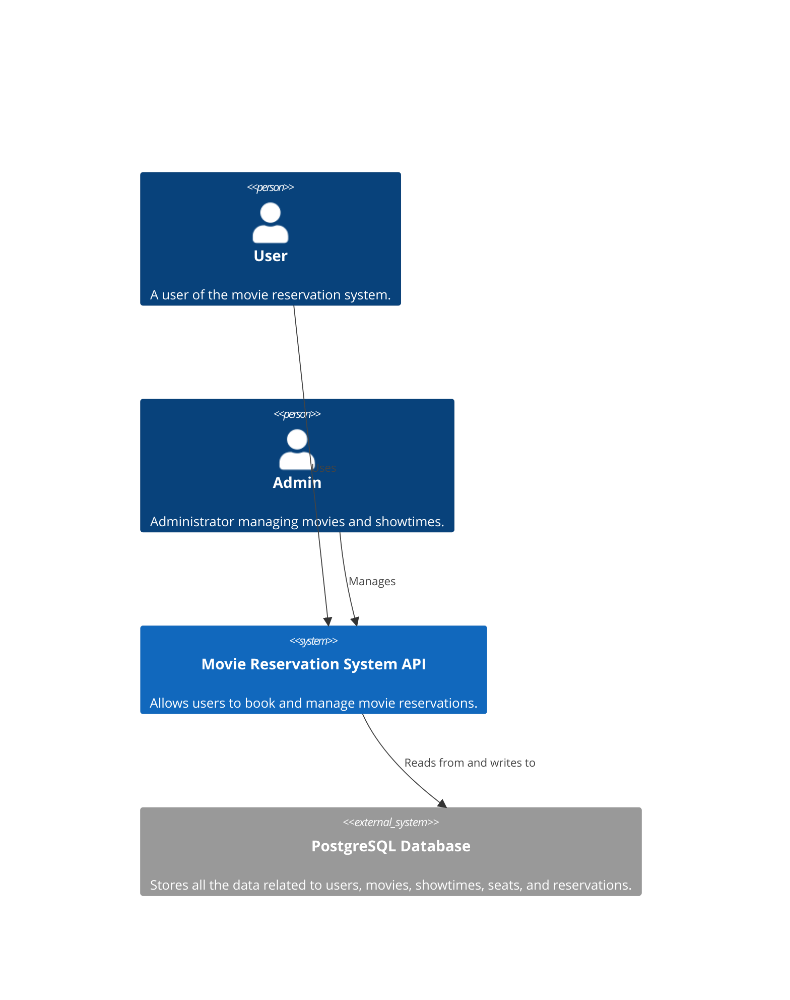
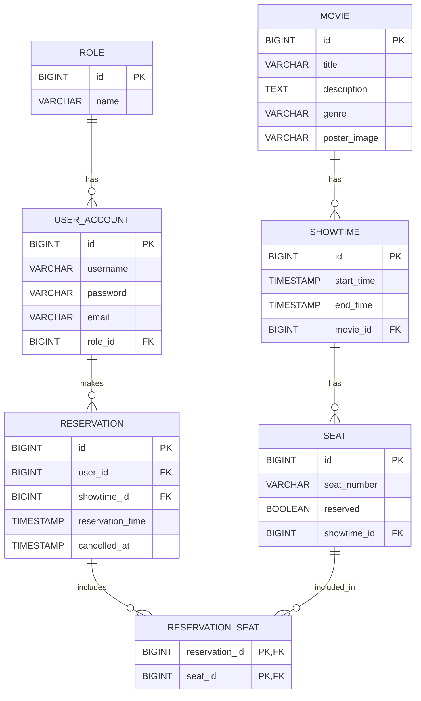

# Movie Reservation System API

## Overview

### The Movie Reservation System API provides the following functionalities:

- **User Registration & Authentication:** Secure user signup and login using JWT
- **Role-Based Access Control:** Differentiate between admin and regular users.
- **Movie Management:** Manage movies and their showtimes.
- **Seat Reservation:** Reserve and release seats for specific showtimes.
- **Reservation Cancellation:** Cancel reservations with proper seat release and timestamping.

## Diagrams

### Context

### ERD

